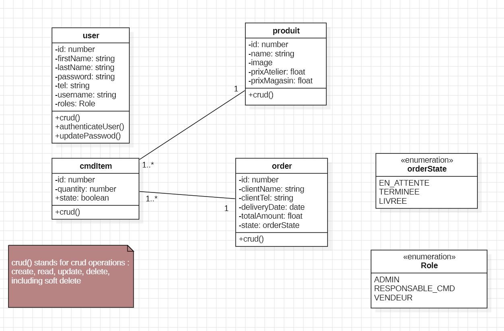

# Order_Management_App

The Order Management App is a web application designed to address miscoordination between the shop and the workshop.
It ensures that orders taken by the shop are automatically communicated to the workshop, preventing delays and 
misunderstandings caused by physical separation of the teams.

---

## Architecture

This project follows a **classic MVC architecture**:

- **Model** → JPA Entities (User, order, product, etc.)
- **View** → Angular Frontend
- **Controller** → Spring REST Controllers

The application is:
- **Backend**: Spring Boot (running on localhost)
- **Frontend**: Angular
- **Database**: PostgreSQL (Dockerized)

---

##  Tech Stack

### Backend
- Java 21
- Spring Boot
- Spring MVC
- Spring Security + JWT
- Spring Data JPA
- Maven

### Frontend
- Angular

### Database
- PostgreSQL (Docker)

### DevOps
- Docker
- Docker Compose

---

## Main Functionalities

- Authentication using JWT
- order management
- products management
- Secure API access with Spring Security

---

## Class Diagram (UML)

The Class Diagram explains the core business logic and relationships between entities.

## Docker Setup (PostgreSQL Only)
- start database: docker-compose up -d
- stop database: docker-compose down

## Installation & Run
### 1- clone the repository:
- git clone : https://github.com/SoumayaTemmar/Order_Management_Backend.git
- cd Order_Management_Backend

### 2- Run Backend (Spring Boot)
- mvn clean install
- mvn spring-boot:run

### frontEnd Repository:
https://github.com/SoumayaTemmar/Order_Management_Frontend.git

👤 Author

Name: Soumaya Temmar

GitHub: https://github.com/SoumayaTemmar/

## ⚠️ License Notice

You are allowed to **view and learn from the source code**, but you are **NOT allowed to host,
sell, or use this application for commercial purposes** without explicit permission from the author.

## © Copyright

© 2025 Soumaya Temmar. All rights reserved.
